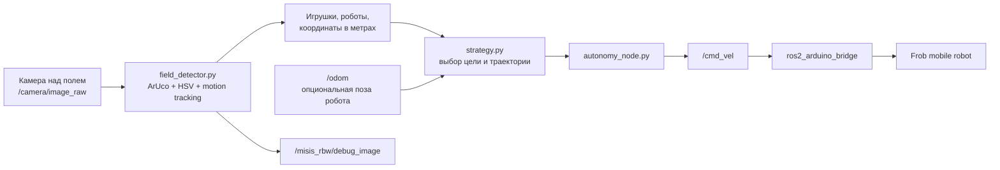
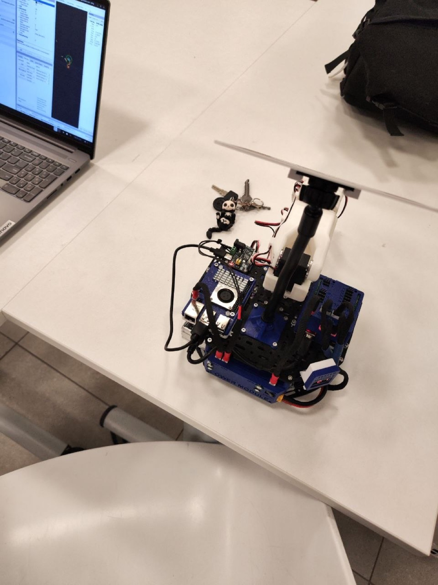
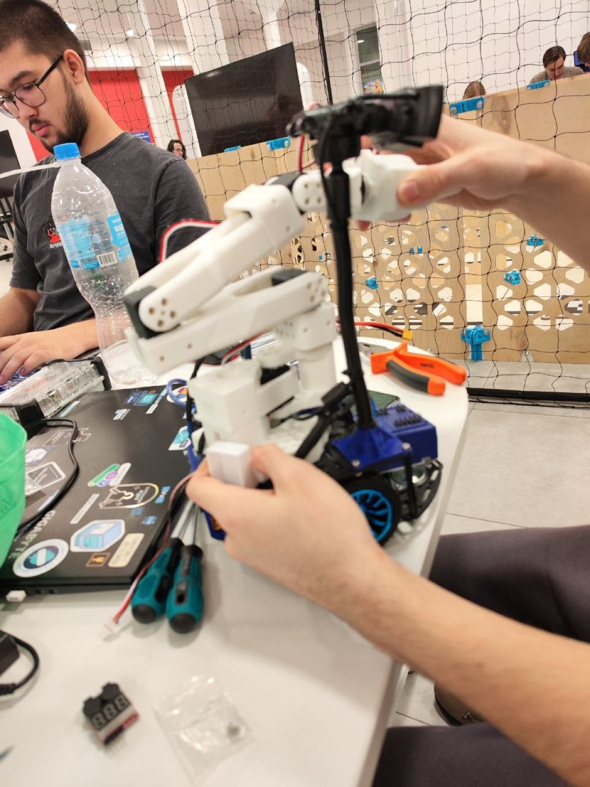
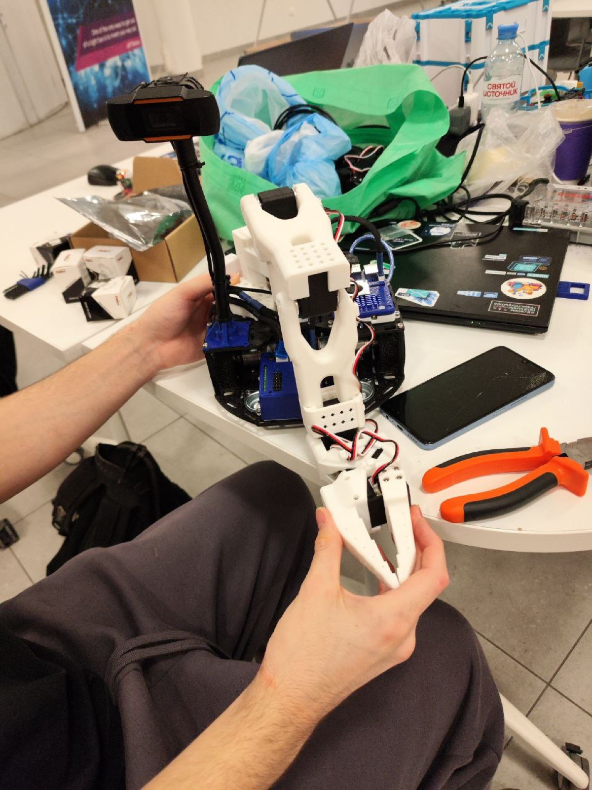
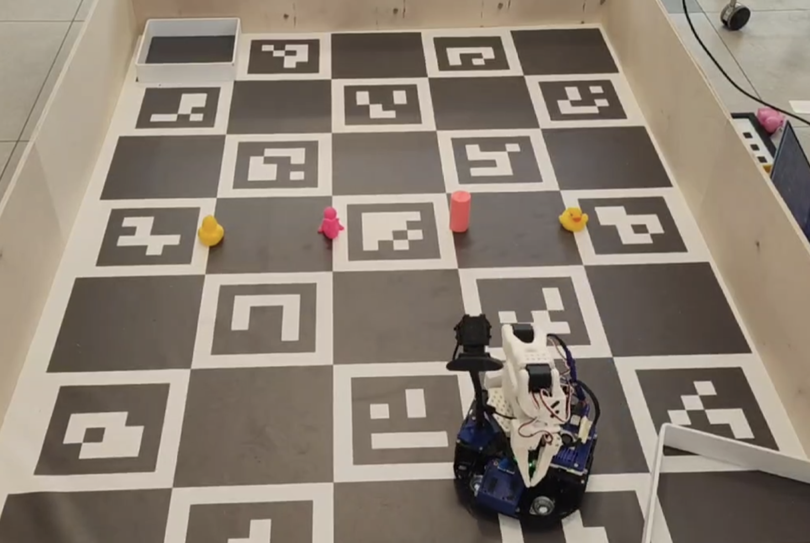

# arbuzi_mss_rbw


`misis_arbuzi` - автономная ROS2-логика для мобильного робота Frob, подготовленная для хакатона [MISIS Robotics Week, Хакатон по мобильным ROS2 роботам](https://misis.ru/events/6739/). Проект решает задачу распознавания игрового поля, цветных объектов и роботов-соперников, после чего строит движение робота для набора очков за 90-секундный заезд.

Проект занял **2 место** на соревновании 21.02.2026. В качестве базы использован open-source робот [Frob_robot](https://github.com/dark516/Frob_robot); поверх него добавлены модуль компьютерного зрения, стратегия движения и ROS2-нода соревнования.

## Установка и запуск

Требуемое окружение:

- Ubuntu 24.04 или совместимая Linux-система на роботе/ноутбуке оператора
- ROS2 Jazzy
- Python 3.10+
- OpenCV с модулем ArUco, NumPy, `cv_bridge`
- собранная аппаратная платформа Frob с Arduino bridge

Установка зависимостей:

```bash
sudo apt update
sudo apt install ros-jazzy-desktop python3-colcon-common-extensions python3-opencv python3-numpy ros-jazzy-cv-bridge ros-jazzy-nav-msgs
```

Сборка workspace:

```bash
git clone https://github.com/ropraname/arbuzi_mss_rbw.git
cd arbuzi_mss_rbw/ros2/src/ros2_ws
rosdep install --from-paths src --ignore-src -r -y
colcon build --symlink-install
source install/setup.bash
```

Запуск базовых узлов Frob:

```bash
ros2 launch frob_bringup bringup.launch.py
```

Запуск автономной логики соревнования:

```bash
ros2 launch misis_rbw_autonomy rbw_autonomy.launch.py
```

Параметры камеры, топиков и скоростей лежат в `ros2/src/ros2_ws/src/misis_rbw_autonomy/config/rbw_strategy.yaml`. Для быстрой проверки исходного детектора на видео можно использовать:

```bash
python3 tools/unified_detector.py --source docs/media/demo/run_2.mp4
```

## Основной функционал

- определение координат поля по ArUco-маркерам и перевод пикселей в метры;
- распознавание цветных игровых объектов размером 4-6 см;
- обнаружение и трекинг движущихся роботов размером 20-30 см;
- выбор цели по эвристике "ценность объекта / расстояние";
- объезд близких динамических препятствий;
- публикация управляющих команд в `/cmd_vel` для штатного `ros2_arduino_bridge`;
- публикация отладочного изображения `/misis_rbw/debug_image` с рамками, координатами и треками.

## Технологии и инструменты

- **ROS2 Jazzy** - узлы, launch-файлы, топики и интеграция с Frob.
- **Python** - детектор, стратегия и ROS2-нода.
- **OpenCV** - ArUco, HSV-сегментация, background subtraction MOG2.
- **NumPy** - гомография, геометрия поля и расчет расстояний.
- **Frob robot** - мобильная аппаратная платформа, Arduino bridge, одометрия, LiDAR/IMU из базового проекта.
- **Docker** - сохранены Docker-файлы исходного Frob-проекта для воспроизводимого окружения.

## Команда проекта

| Участник | Вклад | GitHub |
| --- | --- | --- |
| Лосева Полина Сергеевна | компьютерное зрение, стратегия, тестирование и оформление результата | [doormamu](https://github.com/doormamu) |
| Кузнечик Борис Александрович | разработка ROS2-логики, программирование, интеграция и тестирование | [BorisK7](https://github.com/BorisK7) |
| Запольских Николай Викторович | компьютерное зрение, калибровка поля, разработка и тестирование | [iamteslic](https://github.com/iamteslic) |
| Мусифулин Даниль Рашидович | сборка и настройка робота, аппаратная интеграция и тестирование | [DanilMusifulin](https://github.com/DanilMusifulin) |
| Саргин Ярослав Сергеевич | навигация, программирование, тестирование на полигоне и демо | [ropraname](https://github.com/ropraname) |
| Епифанцев Тарас | низкоуровневое программирование железа, навигация и тестирование | [2taras](https://github.com/2taras) |

## Архитектура



Структура ключевых файлов:

```text
ros2/src/ros2_ws/src/misis_rbw_autonomy/
├── config/rbw_strategy.yaml          # параметры матча, топиков и скоростей
├── launch/rbw_autonomy.launch.py     # запуск автономной логики
├── misis_rbw_autonomy/
│   ├── autonomy_node.py              # ROS2-нода: camera -> detector -> strategy -> cmd_vel
│   ├── field_detector.py             # ArUco, цветные объекты, трекинг роботов
│   └── strategy.py                   # эвристика выбора цели и движения
├── package.xml
└── setup.py

tools/unified_detector.py             # исходный standalone-детектор с хакатона
docs/media/                           # фото, видео и отладочные скриншоты
docs/form/                            # черновик ответов для формы перезачета
```

## Демонстрация

<p>
  
  
  
</p>

Отладочное окно детектора:



Видео заездов:

- [run_1.mp4](docs/media/demo/run_1.mp4)
- [run_2.mp4](docs/media/demo/run_2.mp4)

## Итог

Проект показывает, что недорогая образовательная платформа Frob может решать прикладную задачу автономной робототехники: видеть поле, находить игровые объекты, принимать решение о цели и отдавать команды движению через ROS2. В отличие от ручного телеуправления, решение собирает полный цикл автономии: восприятие, трекинг, стратегия и интеграция с физическим роботом.

Возможные улучшения:

- добавить идентификацию своего робота по визуальному маркеру;
- обучить ML-детектор для устойчивого распознавания объектов при сложном освещении;
- расширить стратегию планировщиком траектории с учетом стенок и зон поля;
- записывать rosbag каждого заезда для последующего анализа.

## Лицензия

Код распространяется по лицензии Apache-2.0. Базовая робототехническая платформа импортирована из проекта [dark516/Frob_robot](https://github.com/dark516/Frob_robot), также распространяемого как open-source проект.
